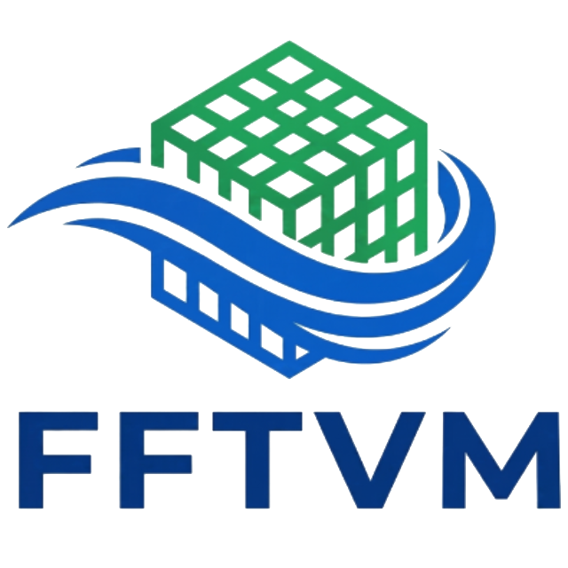
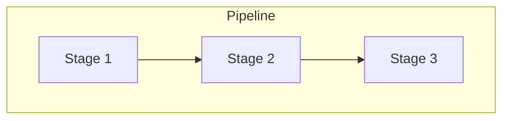
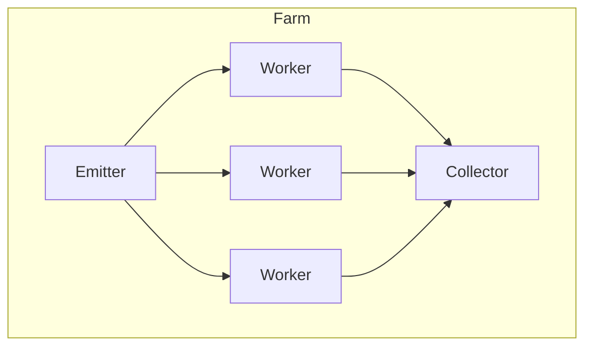
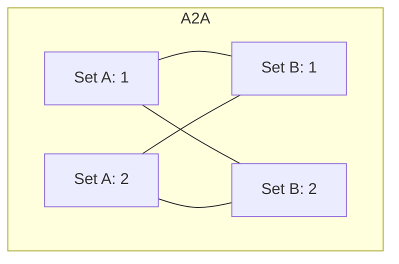
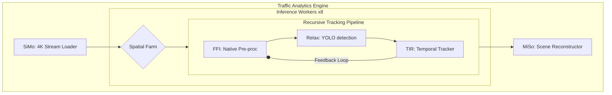

# FFTVM: High-Performance Parallel Execution Engine for the TVM Ecosystem

<p align="center">
  
</p>

FFTVM is a high-performance bridging library that integrates the **FastFlow** C++ parallel runtime with the **TVM FFI** (Foreign Function Interface). It enables developers to construct complex, lockless, native-speed parallel dataflow graphs specifically optimized for AI/ML inference and heterogeneous hardware orchestration.

## 📑 Table of Contents
- [📖 External Documentation](#external-documentation)
- [🎯 Project Context: DARE (Research Project)](#project-context-dare-research-project)
- [💡 Motivation & The "Why"](#motivation--the-why)
    - [❓ The Problem](#the-problem)
    - [✅ The Solution: ABI-Level Structural Integration](#the-solution-abi-level-structural-integration)
    - [⚡ The Result & Superpower](#the-result--superpower)
- [📦 Installation](#installation)
    - [👤 For Users](#for-users)
    - [🛠️ For Developers](#for-developers)
- [📘 User Guide](#user-guide)
    - [🌊 FastFlow Principles: Stream-Based Parallelism](#fastflow-principles-stream-based-parallelism)
    - [🧱 The "Building Blocks" Philosophy](#the-building-blocks-philosophy)
    - [🔄 The Node Lifecycle](#the-node-lifecycle)
    - [🚦 Task Routing & Tokens](#task-routing--tokens)
    - [➕ Creating a Node](#creating-a-node)
    - [🏗️ Composing Topologies](#composing-topologies)
- [🌟 Showcase: Advanced Parallel Workflows](#showcase-advanced-parallel-workflows)
    - [🏙️ The "Grand Tour": Hierarchical Traffic Orchestration Engine](#the-grand-tour-hierarchical-traffic-orchestration-engine)
- [🛡️ Developer Section (Under the Hood)](#developer-section-under-the-hood)
    - [🏗️ Part A: Architecture & Memory Model](#part-a-architecture--memory-model)
    - [🌉 Part B: The TVM FFI Infrastructure (Under the Hood)](#part-b-the-tvm-ffi-infrastructure-under-the-hood)
    - [📝 Part C: Low-Level Implementation Notes (libfftvm.cpp)](#part-c-low-level-implementation-notes-libfftvmcpp)
    - [🔬 Part D: The TVM Runtime & Execution Model (Research Deep-Dive)](#part-d-the-tvm-runtime--execution-model-research-deep-dive)
- [🚀 Future Roadmap: Distributed Systems](#future-roadmap-distributed-systems)

## External Documentation
For a deeper understanding of the underlying frameworks, please refer to:
- **FastFlow**: [FastFlow GitHub & Wiki](https://github.com/fastflow/fastflow)
- **Apache TVM FFI**: [TVM FFI Documentation](https://tvm.apache.org/docs/arch/index.html) (Core FFI and Object System)

## 🎯 Project Context: DARE (Research Project)

<p align="center">
  
  <br>
  
</p>

This library was developed as part of the [**DARE Project**](https://dare-europe.eu/) (Distributed AI for REal-time applications) to explore the integration of stream-oriented parallelism within the TVM ecosystem. 

FFTVM is a research project from the **University of Pisa (Unipi)**, developed under the leadership of [**Massimo Torquati**](https://pages.di.unipi.it/torquati/). The core objective is to bridge **FastFlow** and **TVM’s FFI ABI**, enabling the construction of asynchronous inference pipelines where throughput is optimized through the coordination of heterogeneous stages.


## Motivation & The "Why"

### The Problem
In Python, true multithreading is blocked by the Global Interpreter Lock (GIL). Multiprocessing bypasses the GIL but introduces massive serialization overhead (Pickling), which destroys performance when passing large data structures like Deep Learning Tensors (`NDArray`). 

### The Solution: ABI-Level Structural Integration
FFTVM isn't just a general-purpose parallel library; it realizes a **structural integration at the ABI (Application Binary Interface) level**. 
- **Production-Ready AI Inference**: Pass `tvm.runtime.NDArray` objects between nodes with zero-copy.
- **Unified Memory Model**: Leverage TVM's reference-counted memory across C++ threads without the overhead of context switching between different memory managers.
- **Hardware Orchestration**: Easily build workflows where different stages or workers in a `Farm` are pinned to specific hardware accelerators (GPUs, NPUs, DSPs).

By embedding FastFlow constructs directly into TVM's native type system, the parallel engine becomes a seamless extension of the TVM runtime, ensuring that tasks transitioning between Python and C++ maintain strict memory safety without conversion overhead.

### The Result & Superpower
With FFTVM, you construct your parallel graph topology (e.g., Pipeline, Farm) entirely in Python. During execution, the graph runs on C++ FastFlow threads. 

The true superpower of FFTVM is **Heterogeneous AI Workflows**:
- If a Node is implemented in pure Python, it runs on a C++ thread but must acquire the GIL.
- **If a Node is implemented in Native C++, TVM Script, or a compiled Relax module, it executes completely independently of the GIL.** This allows you to achieve true native parallel performance for heavy tensor operations while using Python for orchestration.

---

## Installation

### 👤 For Users
FFTVM is available on PyPI. Ensure you have the TVM runtime installed on your system.
```bash
pip install fftvm
```

### For Developers
If you are contributing to the FFTVM core or want to build from source:

1. **Build the C++ Library**:
   ```bash
   ./build.sh
   ```
2. **Setup Development Environment**:
   To install FastFlow and the TVM runtime locally for development:
   ```bash
   ./setup.sh
   ```
3. **Install into Environment**:
   To install the compiled library into your primary development environment (e.g., sourced via `.env`):
   ```bash
   ./install_to_env.sh
   ```
   *Note: Avoid `pip install -e .` for this project as it causes shared library discovery issues with C++ extensions.*

---

## User Guide

### FastFlow Principles: Stream-Based Parallelism
To effectively use FFTVM, it is helpful to understand the core principles of **FastFlow**:
- **Stream Processing**: Data flows through a series of stages (Nodes) like a stream. Each stage processes one task at a time.
- **Lock-Free Communication**: Tasks travel between stages via high-performance lock-free queues. This ensures minimal overhead even when passing thousands of tasks per second.
- **Sequential within Parallel**: While the overall graph runs in parallel, each individual Node processes its tasks sequentially. This simplifies development as you don't need to worry about mutexes inside your `svc` function.
- **Asynchrony**: Stages are decoupled. If one stage is slow, its input queue fills up, but other stages continue to operate at their own speed (back-pressure).

### The "Building Blocks" Philosophy
FFTVM adopts the core philosophy of **FastFlow**, where complex parallel systems are constructed using a set of composable "bricks" or building blocks. These blocks are classified into two categories:

#### 1. Functional Nodes (Cardinality)
These are the basic processing units defined by their connectivity:
- **`SiSoNode`**: Single Input, Single Output.
- **`SiMoNode`**: Single Input, Multiple Output.
- **`MiSoNode`**: Multiple Input, Single Output.
- **`MiMoNode`**: Multiple Input, Multiple Output.

#### 2. Parallel Patterns (Topologies)
In FastFlow, coordination patterns are themselves building blocks that can be nested and composed:







- **`Pipeline()`**: A linear sequence of stages.
- **`Farm()`**: A master-worker pattern for data parallelism.
- **`A2A()`**: An All-to-All pattern for many-to-many communication.

By decoupling the **Calculation Logic** (inside nodes) from the **Topology** (the coordination block), developers can build complex, scalable architectures through simple composition.

### The Node Lifecycle
When writing a custom Python node, you implement specific methods invoked by the FastFlow C++ engine:
- `svc_init(self)`: Called once when the thread starts. Return `0` on success.
- `svc(self, task)`: The core execution loop. Receives an input task (TVM Object) and must return an output task or a flow control token.
- `svc_end(self)`: Called once when the thread shuts down.
- `eosnotify(self, id)`: (Optional) Triggered when an End-Of-Stream token is received, indicating no more tasks will arrive from a specific upstream worker (`id`).

### Task Routing & Tokens
Control the flow of data using these methods and tokens:
- `self.ff_send_out(task)`: Manually push a task to the next stage.
- `self.ff_send_out_to(task, id)`: Route a task to a specific downstream channel/worker (used in `SiMo` and `MiMo` nodes).
- `return ff.FFToken.EOS()`: Signal that the stream has ended.
- `return ff.FFToken.GO_ON()`: Signal that the node has processed the task but has no output to return.

### Creating a Node
FFTVM provides multiple ways to define the logic of a node, ranging from simple Python functions to native-speed compiled modules.

<details>
<summary><b>Example of Functional Node (Lambda)</b></summary>

Pass any Python callable directly to the constructor for lightweight, stateless processing.
```python
node = ff.SiSoNode(lambda x: x * x)
```
</details>

<details>
<summary><b>Stateful Nodes (Subclassing)</b></summary>

Ideal for nodes that need initialization or internal state management across multiple tasks.
```python
class MyCounter(ff.SiSoNode):
    def svc_init(self):
        self.count = 0
        return 0 # Success
    def svc(self, task):
        self.count += 1
        return self.count
```
</details>

<details>
<summary><b>TVM Registry Native Functions / Modules</b></summary>

Use pre-registered TVM `PackedFuncs` or modules for maximum performance and ecosystem integration.
```python
import tvm
node = ff.SiSoNode(tvm.get_global_func("my_native_op"))
```
</details>

<details>
<summary><b>Native C++ Function (FFI Inline)</b></summary>

Compile and load C++ code directly into a GIL-free node for maximum performance without pre-compiling shared libraries. These functions are executed **outside the GIL**.
```python
import fftvm as ff
import tvm_ffi

cpp_source = '''
#include <tvm/ffi/any.h>
tvm::ffi::Any add_one(tvm::ffi::Any input) {
    if (input.type_index() == 0) return tvm::ffi::Any(); 
    int val = input.cast<int>();
    return val + 1; 
}
'''

native_mod = tvm_ffi.cpp.load_inline("my_ops", cpp_source, ["add_one"])
node = ff.SiSoNode(native_mod.add_one) # Direct native execution
```
</details>

<details>
<summary><b>Using TVM Scripting to produce Native Functions (TIR)</b></summary>

Execute low-level TVM Tensor IR (TIR) kernels directly as parallel stages.
```python
from tvm.script import tir as T
@tvm.script.ir_module
class MyKernel:
    @T.prim_func
    def main(a: T.handle, b: T.handle): 
        # ... TIR implementation ...
rt_mod = tvm.build(MyKernel, target="llvm")
node = ff.SiSoNode(rt_mod["main"])
```
</details>

<details>
<summary><b>TVM Relax Modules</b></summary>

The standard way to run end-to-end deep learning models GIL-free using the TVM Virtual Machine.
```python
vm = relax.VirtualMachine(ex, tvm.cpu())
node = ff.SiSoNode(vm["main"])
```
</details>

### Composing Topologies
Topologies are building blocks that coordinate data flow between nodes.

<details>
<summary><b>Pipeline</b></summary>

A linear chain of processing stages.
```python
pipe = ff.Pipeline().add_stage(N1).add_stage(N2)
```
</details>

<details>
<summary><b>Farm</b></summary>

A master-worker pattern for data parallelism, distributing tasks to a pool of workers.

**⚠️ Crucial Rule**: When providing a list of workers to a Farm, you *must* instantiate independent objects. Do not multiply a single instance.
*Correct*: `[MyWorker() for _ in range(5)]`
*Wrong*: `[worker_instance] * 5`

```python
farm = ff.Farm().add_emitter(E).add_workers([W1, W2]).add_collector(C)
```
</details>

<details>
<summary><b>Collapsed Farm</b></summary>

Coordination logic is "collapsed" into the surrounding Pipeline stages, where the upstream stage scatters and the downstream stage gathers.
```python
# Stage 1 (SiMo) scatters, Stage 3 (MiSo) gathers
workflow = ff.Pipeline().add_stage(S1).add_stage(ff.Farm().add_workers([W1, W2])).add_stage(S3)
```
</details>

<details>
<summary><b>All-to-All (A2A)</b></summary>

Connect a set of producers to a set of consumers in a many-to-many communication pattern.
```python
a2a = ff.A2A().add_firstset([P1, P2]).add_secondset([C1, C2])
```
</details>

<details>
<summary><b>Composing & Nesting</b></summary>

Topologies are building blocks themselves and can be nested to create complex hierarchies.
```python
# A Farm inside a Pipeline stage
nested = ff.Pipeline().add_stage(ff.Farm().add_workers([...])).add_stage(S2)
```
</details>

<details>
<summary><b>Feedback Channels (`wrap_around`)</b></summary>

Create cycles in the graph (feedback channels) for iterative algorithms or recursive processing.
```python
# Feed output of N2 back to input of N1
pipe = ff.Pipeline().add_stage(N1).add_stage(N2).wrap_around()

# Feedback within a Farm (Collector back to Emitter)
farm = ff.Farm().add_emitter(E).add_workers([...]).add_collector(C).wrap_around()
```
</details>

---

## Showcase: Advanced Parallel Workflows

This section demonstrates how FFTVM builds complex, heterogeneous systems that overlap I/O, C++ compute, and multi-accelerator inference entirely outside the GIL.

### The "Grand Tour": Hierarchical Traffic Orchestration Engine
This master workflow demonstrates a production-grade engine for city-scale analytics. It features a **Pipeline** containing a **Farm**, where each worker is itself a **Nested Pipeline** utilizing **Feedback Loops** for temporal object tracking.



```python
import fftvm as ff
import tvm
from tvm import relax

# 1. Component Definition (Heterogeneous Construction)
pre_proc_native = tvm_ffi.cpp.load_inline("preproc", cpp_src, ["preprocess"])
yolo_model = tvm.runtime.load_module("yolo_relax.so")
tracker_kernel = tvm.build(tracker_tir_mod, target="llvm")["main"]

class SceneAggregator(ff.MiSoNode):
    """Global stateful gatherer combining spatial data into a world map."""
    def svc_init(self): 
        self.world_map = {}
        return 0
    def svc(self, local_detection):
        self.world_map.update(local_detection)
        return self.world_map

# 2. Build the Recursive Worker (A Pipeline with a Feedback Channel)
def make_tracking_worker():
    return (ff.Pipeline()
            .add_stage(ff.SiSoNode(pre_proc_native.preprocess))
            .add_stage(ff.SiSoNode(yolo_model))
            .add_stage(ff.SiSoNode(tracker_kernel))
            .wrap_around()) # Feed track state back to pre-processor

# 3. Assemble the Master Engine
orchestrator = (
    ff.Pipeline()
    .add_stage(StreamLoader_SiMo())               # Phase 1: Overlapped I/O
    .add_stage(
        ff.Farm().add_workers([
            make_tracking_worker() for _ in range(8) # Phase 2: Parallelized recursive pipelines
        ])
    )
    .add_stage(SceneAggregator())                # Phase 3: Global Scene Fusion
)

orchestrator.run_and_wait_end()
```

---

<details>
<summary><b>🤖 Multi-Model Heterogeneous Ensemble (Pipeline of Farms)</b></summary>

This example shows a complex AI system where images are processed by a Backbone model (on GPU) and then classified by multiple Head models (on NPU) in parallel.

```python
import fftvm as ff
import tvm
from tvm import relax

# Load two different compiled Relax modules
backbone_vm = relax.VirtualMachine(tvm.runtime.load_module("resnet50.so"), tvm.cuda())
head_vm = relax.VirtualMachine(tvm.runtime.load_module("classifier_head.so"), tvm.cpu())

ensemble = (
    ff.Pipeline()
    .add_stage(ImageLoader_SiMo())                # Scatter frames
    .add_stage(
        ff.Farm().add_workers([
            ff.SiSoNode(backbone_vm["main"]) for _ in range(2) # Parallel Backbone
        ])
    )
    .add_stage(
        ff.Farm().add_workers([
            ff.SiSoNode(head_vm["main"]) for _ in range(4)     # Parallel Heads
        ])
    )
    .add_stage(ResultAggregator_MiSo())           # Gather results
)
ensemble.run_and_wait_end()
```
</details>

<details>
<summary><b>⚡ High-Performance Pre-processing Fusion (TIR + Relax)</b></summary>

Demonstrates mixing low-level **TVM Script (TIR)** kernels for custom tensor normalization with high-level **Relax** models. Both stages execute outside the GIL with zero-copy tensor passing.

```python
import fftvm as ff
import tvm
from tvm.script import tir as T

# 1. Define a custom Normalization kernel in TIR
@tvm.script.ir_module
class MyNorm:
    @T.prim_func
    def main(A: T.handle, B: T.handle):
        # ... optimized normalization logic ...
        pass

rt_norm = tvm.build(MyNorm, target="llvm")

# 2. Build a pipeline where every stage is a Native FFI call
native_pipeline = (
    ff.Pipeline()
    .add_stage(ff.SiSoNode(rt_norm["main"]))      # GIL-Free TIR Kernel
    .add_stage(ff.SiSoNode(compiled_relax_vm))    # GIL-Free Relax Model
    .add_stage(ff.SiSoNode(lambda x: x.numpy()))  # Python Finalizer
)
```
</details>

<details>
<summary><b>🔄 Iterative Model Refinement (Active Learning / RL)</b></summary>

Use `.wrap_around()` to implement iterative loops where a compiled model refines its own output (e.g., iterative mask refinement or RL rollout) without ever returning control to Python.

```python
import fftvm as ff

class RefinementLoop(ff.SiSoNode):
    def svc(self, tensor_state):
        # Compiled TVM model refines the mask
        refined_tensor = self.model(tensor_state)
        
        # Check if confidence is high enough
        if refined_tensor.confidence > 0.95:
            return ff.FFToken.EOS() # Exit loop
        
        return refined_tensor # Feed back for next iteration

# The entire refinement loop executes at native speed
iterative_engine = (
    ff.Pipeline()
    .add_stage(RefinementLoop(my_model))
    .wrap_around()
)
```
</details>

---

## Developer Section (Under the Hood)

This section details the internal architecture for advanced users and contributors.

### Part A: Architecture & Memory Model

#### FastFlow Framework: Stream Parallelism
FFTVM uses **FastFlow** as its underlying execution engine. FastFlow is a high-performance C++ framework designed for **stream-based parallelism**.
- **Dataflow Skeletons**: It provides high-level patterns (Farm, Pipeline, All-to-All) that map directly to multi-core architectures.
- **Lock-Free Communication**: Tasks travel between stages via Single-Producer Single-Consumer (SPSC) or Multi-Producer Multi-Consumer (MPMC) lock-free queues. This eliminates the contention overhead typical of mutex-protected queues.
- **Memory Consistency**: FastFlow ensures that when a worker finishes a task, the memory state is correctly synchronized for the next worker in the pipeline, which is critical for passing large TVM `NDArrays`.

#### Native Execution & Interpreter Bypass
When a pre-compiled TVM function (e.g., a compiled Relax module or a `PackedFunc` loaded from a shared library) is assigned to a node, FFTVM's execution engine performs a signature inspection. If the function is recognized as a native FFI object, the framework executes it directly within the FastFlow worker threads. This **completely bypasses the Python interpreter** during the critical path of execution, achieving "zero-copy" performance comparable to a native C++ implementation.

#### Thread Mapping & TVM Reference Counting
Every Node instantiated in Python triggers the creation of an underlying C++ `ff::ff_node` derived class. FastFlow maps this node to a physical OS thread. 
Because tasks are wrapped in `tvm::ffi::Any`, the TVM FFI automatically manages the reference counts of the underlying objects (e.g., `NDArray`). When a task is pushed into a FastFlow lockless queue, the C++ thread safely holds the reference, ensuring memory safety without global locks.

#### High-Throughput Task Passing (Zero-Copy)
FastFlow queues expect pointers. To satisfy this while using TVM's `Any` type, FFTVM allocates `tvm::ffi::Any` containers on the heap. Crucially, it uses FastFlow's custom lock-free memory allocator (`ff::FFAllocator`) via `ff_alloc_any()` and `ff_free_any()`. This prevents the OS memory allocator from becoming a bottleneck during high-frequency task passing across threads.

#### Python Mixin Magic & Dynamic Arity
To make Python classes seamlessly compatible with the C++ engine, `fftvm/__init__.py` utilizes a `_baseNodeMixin`. When you instantiate a Python node:
1. The mixin inspects your `svc`, `svc_init`, etc., using Python's `inspect` module.
2. It **detects arity**: If a function takes 1 argument, it passes only the `task`. If it takes 2, it passes `(self, task)`. This allows passing native FFI PackedFuncs (which don't have a `self`) directly to nodes.
3. It dynamically wraps your Python method into a `tvm_ffi.Function`, ensuring the `self` context is maintained when the C++ thread invokes the callback.

### Part B: The TVM FFI Infrastructure (Under the Hood)

FFTVM relies on the `apache-tvm-ffi` library to provide a unified object model. Understanding how TVM manages types and memory is crucial for extending the project.

<details>
<summary><b>1. The Unified Type System (`type_index`)</b></summary>

TVM does not use standard C++ RTTI. Instead, it maintains a global **Type Registry**.
- **Static vs. Dynamic**: Every class (e.g., `SiSoNode`) is assigned a unique integer `type_index`.
- **Registration**: The `TVM_FFI_DECLARE_OBJECT_INFO` macro registers a string identifier (like `"fftvm.SiSoNode"`) and ensures that `_GetOrAllocRuntimeTypeIndex()` returns a consistent ID across different shared libraries.
- **Hierarchy**: All managed objects must inherit from `tvm::ffi::Object`. This allows for a single root type and safe downcasting via `.cast<T>()`.
</details>

<details>
<summary><b>2. Memory Model: `Object` and `ObjectRef`</b></summary>

TVM uses a **Handle-Body** pattern to bridge Python and C++ memory management.
- **The Body (`Object`)**: Contains the raw data and an atomic reference counter. It lives on the heap.
- **The Handle (`ObjectRef`)**: A stack-allocated smart pointer. When an `ObjectRef` is copied (including when passed to Python), the body's reference count is incremented.
- **Python Integration**: The Python object holds a pointer to the C++ `Object` and participates in the reference counting. When the Python object is garbage-collected, the C++ ref count decrements, potentially triggering `delete`.
</details>

<details>
<summary><b>3. The Global Reflection Registry</b></summary>

How does Python know `ff_send_out` exists in C++?
- **`ObjectDef<T>`**: Inside the `TVM_FFI_STATIC_INIT_BLOCK`, we populate a reflection table for each type. 
- **Method Binding**: `.def("name", function)` stores a `PackedFunc` (a type-erased function wrapper) in a global registry keyed by `(type_index, "method_name")`.
- **Lookup**: When you call `node.ff_send_out()` in Python, the FFI performs a runtime lookup in this registry and invokes the bound C++ lambda.
</details>

<details>
<summary><b>4. Type-Erasure via `tvm::ffi::Any`</b></summary>

The `Any` container is the fundamental unit of data exchange in TVM.
- **Structure**: It is a small union (8-16 bytes) that can hold a primitive (int, float) or a pointer to a `tvm::ffi::Object`.
- **Zero-Copy**: Because `NDArray` is a `tvm::ffi::Object`, passing it via `Any` simply passes a pointer and increments a reference count. No data is copied.
- **Uniform ABI**: All FFI functions share the same signature: `Any(Any* args, int num_args)`. This makes it trivial to wrap any C++ function into a `PackedFunc` callable from Python.
</details>

### Part C: Low-Level Implementation Notes (`libfftvm.cpp`)

The core of FFTVM is a C++ "Forwarder" that translates between FastFlow's raw pointer-based message passing and TVM's high-level FFI system.

<details>
<summary><b>1. The Node Proxy Pattern (Object vs. Impl)</b></summary>

To allow Python subclassing while maintaining C++ thread performance, FFTVM uses a two-tier architecture for every node:
- **The Proxy (`tvm::ffi::Object`)**: This is what Python "sees." It manages the lifecycle and holds references to the TVM functions (`svc`, `svc_init`). It inherits from [tvm::ffi::Object](https://github.com/apache/tvm/blob/main/include/tvm/ffi/object.h).
- **The Implementation (`ff::ff_node`)**: An internal C++ struct (e.g., `SiSoNodeImpl`) that inherits from FastFlow's [ff_node](https://github.com/fastflow/fastflow/blob/master/ff/node.hpp). It lives inside a `std::unique_ptr` within the Proxy.

**The Trick**: When FastFlow starts a thread, it calls the `svc()` method of the **Implementation**. This C++ method then "reaches back" into the **Proxy** to invoke the TVM function (which might be a Python method). This separation ensures that the physical thread state is decoupled from the TVM reference-counting logic.
</details>

<details>
<summary><b>2. Memory Management (`Any` Containers)</b></summary>

FastFlow queues pass `void*` pointers. Since [tvm::ffi::Any](https://github.com/apache/tvm/blob/main/include/tvm/ffi/any.h) is a stack-allocated container, we must wrap it in heap-allocated containers to pass it between threads. To avoid the OS memory allocator bottleneck, we use FastFlow's lock-free [ff_allocator](https://github.com/fastflow/fastflow/blob/master/ff/allocator.hpp):

```cpp
static inline tvm::ffi::Any* ff_alloc_any(tvm::ffi::Any&& from) {
    // Uses ff::FFAllocator for high-frequency allocation
    void* anyptr_raw = ff::FFAllocator::instance()->malloc(sizeof(tvm::ffi::Any));
    return new (anyptr_raw) tvm::ffi::Any(std::move(from));
}
```
</details>

<details>
<summary><b>3. Control Token Pointer Hacks (The `FFToken` Trick)</b></summary>

FastFlow uses special address constants (like `(void*)ULLONG_MAX`) for control signals like `EOS`. Since FFTVM is typed to return `Any*`, we reinterpret the `FFToken::key` back into a raw pointer:

```cpp
// Unsafe reinterpret: The token key (uintptr_t) becomes the raw pointer address
Any* tkn = reinterpret_cast<Any *>(r.cast<FFToken_ref>()->key); 
return tkn;
```
This allows the Python `return ff.FFToken.EOS()` to be converted back into the low-level signal FastFlow expects.
</details>

<details>
<summary><b>4. Technical Source Links</b></summary>

- **TVM FFI Core**: [apache/tvm-ffi](https://github.com/apache/tvm-ffi)
    - [any.h](https://github.com/apache/tvm-ffi/blob/main/include/tvm/ffi/any.h) (Type-erased container)
    - [object.h](https://github.com/apache/tvm-ffi/blob/main/include/tvm/ffi/object.h) (Reference-counted base)
- **FastFlow Core**: [fastflow/fastflow](https://github.com/fastflow/fastflow)
    - [node.hpp](https://github.com/fastflow/fastflow/blob/master/ff/node.hpp) (Base execution unit)
    - [allocator.hpp](https://github.com/fastflow/fastflow/blob/master/ff/allocator.hpp) (Lock-free memory)
- **FFTVM Source**: [src/libfftvm.cpp](./src/libfftvm.cpp)
</details>

### Part D: The TVM Runtime & Execution Model (Research Deep-Dive)

FFTVM's ultimate research goal is the structural fusion of parallel dataflows with TVM's internal execution path. This requires a granular understanding of how TVM lowers and executes code.

<details>
<summary><b>1. IR Trajectory: From Functional Graphs to Machine Code</b></summary>

TVM uses a multi-stage lowering process, each governed by a set of [Transform Passes](https://github.com/apache/tvm/tree/main/src/relax/transform):
- **Relax IR ([functional_ir.h](https://github.com/apache/tvm/blob/main/include/tvm/relax/expr.h))**: A dataflow-centric IR that supports symbolic shapes and dynamic control flow. During compilation, the [Relax-to-TIR lowering](https://github.com/apache/tvm/blob/main/src/relax/transform/realize_vdevice.cc) pass identifies high-level operators and maps them to low-level loop kernels.
- **TIR ([op.h](https://github.com/apache/tvm/blob/main/include/tvm/tir/op.h))**: A representation of multi-dimensional loops and memory buffers. TIR is where [Schedule](https://github.com/apache/tvm/blob/main/include/tvm/tir/schedule/schedule.h) primitives (Split, Fuse, Vectorize) are applied to optimize for specific instruction sets (AVX-512, Tensor Cores).
- **Codegen**: The [LLVM backend](https://github.com/apache/tvm/tree/main/src/target/llvm) or specialized backends (CUDA, OpenCL) translate TIR into target modules. The output is a [runtime::Module](https://github.com/apache/tvm/blob/main/include/tvm/runtime/module.h) containing `PackedFuncs`.
</details>

<details>
<summary><b>2. Relax VM Architecture: Bytecode & Frames</b></summary>

The [Relax Virtual Machine](https://github.com/apache/tvm/blob/main/include/tvm/runtime/relax_vm/vm.h) is a register-based executor for compiled Relax modules.
- **The Executable ([executable.h](https://github.com/apache/tvm/blob/main/include/tvm/runtime/relax_vm/executable.h))**: Contains the [Bytecode](https://github.com/apache/tvm/blob/main/include/tvm/runtime/relax_vm/bytecode.h) instructions (e.g., `Call`, `Ret`, `Goto`) and a constant pool.
- **VMFrame**: For every function call, the VM pushes a frame that manages local registers. Each register is a `tvm::ffi::Any` container, holding an [ObjectRef](https://github.com/apache/tvm/blob/main/include/tvm/ffi/object.h).
- **Execution Loop**: The VM iterates through bytecode, dispatching `Call` instructions to the underlying `PackedFuncs` compiled from TIR or provided by the [External Registry](https://github.com/apache/tvm/blob/main/include/tvm/runtime/registry.h).
</details>

<details>
<summary><b>3. Memory System: Storage & NDArray</b></summary>

TVM's memory model is designed for zero-copy efficiency across language boundaries.
- **StorageObj ([storage.h](https://github.com/apache/tvm/blob/main/include/tvm/runtime/relax_vm/storage.h))**: Represents a raw allocation on a specific device. It acts as the physical memory container.
- **NDArray ([ndarray.h](https://github.com/apache/tvm/blob/main/include/tvm/runtime/ndarray.h))**: A view into a `StorageObj` with specific shape, data type, and strides.
- **Reference Counting**: All memory is reference-counted via the `Object` base class. In FFTVM, when an `NDArray` is passed between nodes, only the pointer is shared, and the internal `AtomicRefCount` is updated, preventing copies.
- **DeviceAPI ([device_api.h](https://github.com/apache/tvm/blob/main/include/tvm/runtime/device_api.h))**: The abstraction layer for allocating and copying memory on CPU, GPU, etc.
</details>

<details>
<summary><b>4. The Shared ThreadPool Bottleneck (Research Limitation)</b></summary>

A critical area for research is the interaction between FastFlow threads and TVM's [Internal Threading Backend](https://github.com/apache/tvm/blob/main/src/runtime/threading_backend.cc).
- **Global Pool**: TVM initializes a single, shared `ThreadPool` per process. When a TIR kernel executes a parallel loop (e.g., via OpenMP or TVM's native pool), it dispatches work to this global set of threads.
- **Conflict with FFTVM**: In FFTVM, each node runs on its own dedicated OS thread (managed by FastFlow). If multiple nodes call TVM kernels simultaneously, they all attempt to use the **same shared pool**, leading to context-switching overhead and cache trashing.
- **Future Integration Goals**:
    - **NUMA-Aware Partitioning**: Extending the [DeviceAPI](https://github.com/apache/tvm/blob/main/include/tvm/runtime/device_api.h) to allow the creation of "Partitioned CPU Devices" that only use specific core sets (via `pthread_setaffinity_np`).
    - **Memory Placement**: Aligning FastFlow's [ff_allocator](https://github.com/fastflow/fastflow/blob/master/ff/allocator.hpp) with TVM's `StorageObj` to ensure data resides in the same NUMA node as the worker thread.
    - **Scheduler Fusion**: Bridging FastFlow's lock-free queues with TVM's work-stealing logic to enable true fine-grained hardware orchestration.
</details>

---

## Future Roadmap: Distributed Systems
While current versions focus on shared-memory multi-core systems, future releases of the underlying FastFlow engine aim to support **distributed execution**, enabling FFTVM graphs to span multiple physical machines while maintaining the same Python-centric API.
I.
